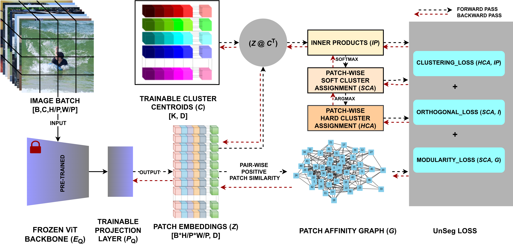

# GraPix: Exploring Graph Modularity Optimization for Unsupervised Pixel Clustering

## Data directory organization
```
data
|
suim
|
|── imgs
|   ├── train
|   |   |── name_1.jpg
|   |   └── name_2.jpg
|   └── val
|       |── name_11.jpg
|       └── name_22.jpg
└── labels
    ├── train
    |   |── name_1.png
    |   └── name_2.png
    └── val
        |── name_12.png
        └── name_22.png
```
## Setup Conda Environment
```
Step 1: Go to the GraPix-master folder
Step 2: Run CMD 'conda env create -f GraPix.yml'
```
## Training GraPix

## Evaluating Grapix
```
Step 1: Modify the eval.yaml file of the Config folder accordingly. Change the 'experiment_name' and 'model_paths'.
Step 2: Run cmd 'python eval_segmentation.py'
Note: To reproduce paper results for the GraPix stage, comment out lines 64 to 70 in the 'main.py' file. 
```
