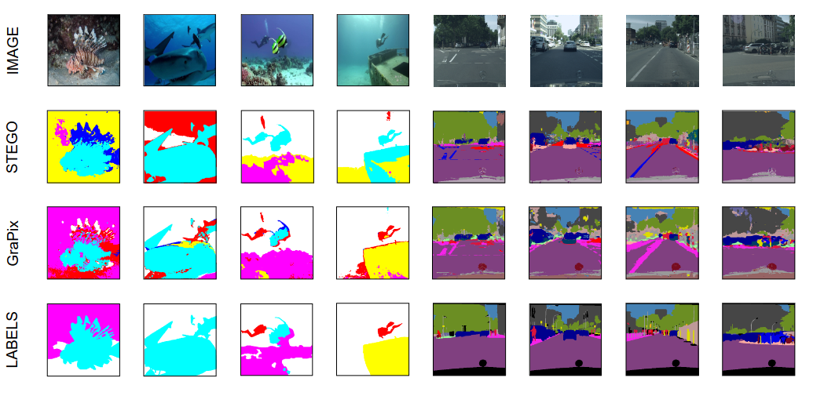
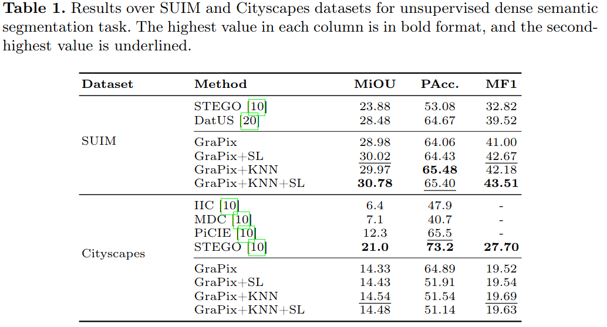

# GraPix: Exploring Graph Modularity Optimization for Unsupervised Pixel Clustering 
### This [Paper](https://doi.org/10.1007/978-3-031-78192-6_13) is accepted in the 'International Conference on Pattern Recognition (ICPR) 2024.


## Unsupervised Segmentation Loss


## Data directory organization
```
data
|
suim
|
|── imgs
|   ├── train
|   |   |── name_1.jpg
|   |   └── name_2.jpg
|   └── val
|       |── name_11.jpg
|       └── name_22.jpg
└── labels
    ├── train
    |   |── name_1.png
    |   └── name_2.png
    └── val
        |── name_12.png
        └── name_22.png
```
## Setup and Activate Conda Environment
```
Step 1: cd GraPix-master folder
Step 2: conda env create -f GraPix.yml
Step 3: conda activate GraPix
```
## Training GraPix
```
Step 1: cd src/
Step 2: python main.py
NOTE: Edit dataset path in 'config/train.yaml' before training. Also, after the GraPix training set required booling variable to 'true' and change checkpoint path in yaml file for corresponding Additional Unsupervised Training.
```
## Evaluating Grapix
```
Step 1: Modify the eval.yaml file of the Config folder accordingly. Change the 'experiment_name' and 'model_paths'.
Step 2: Run cmd 'python eval_segmentation.py'
Note: To reproduce paper results for the GraPix stage, comment out lines 64 to 70 in the 'main.py' file. 
```
## Results



## Cite Us
```
Kumar, S., Sur, A., Baruah, R.D. (2025). GraPix: Exploring Graph Modularity Optimization for Unsupervised Pixel Clustering. In: Antonacopoulos, A., Chaudhuri, S., Chellappa, R., Liu, CL., Bhattacharya, S., Pal, U. (eds) Pattern Recognition. ICPR 2024. Lecture Notes in Computer Science, vol 15310. Springer, Cham. https://doi.org/10.1007/978-3-031-78192-6_13 
```
## Acknowledgement
We thank the authors of the [STEGO](https://github.com/mhamilton723/STEGO) for providing details on their implementation, which is used to develop the GraPix Framework.
